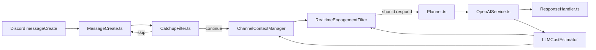

# Realtime Engagement System

## Purpose
The realtime engagement loop provides a context-aware flow that stays quiet when appropriate, tracks channel memory, and records LLM spend.

## Current Flow

---

## CatchupFilter
**Goal:** Keep low-signal chatter away from the planner.  
**Notes:**
- Implemented in `packages/discord-bot/src/utils/CatchupFilter.ts`.
- Returns `{ skip, reason }` and biases toward “let the planner decide.”
- Wired into `packages/discord-bot/src/events/MessageCreate.ts`.

---

## ChannelContextManager
**Goal:** Maintain short-term channel/thread memory and metrics.  
**Notes:**
- Implemented in `packages/discord-bot/src/state/ChannelContextManager.ts`.
- Feature flag: `CONTEXT_MANAGER_ENABLED`.
- Provides `recordMessage`, `getRecentMessages`, `recordLLMUsage`, `evictExpired`, `resetChannel`.
- Structured logs emitted: `context_message_recorded`, `context_llm_usage`, `context_state`, `context_eviction`, `context_channel_reset`.
- Automatic eviction prevents memory leaks (default 5 minutes).
- Legacy counters remain available for compatibility.

---

## LLMCostEstimator
**Goal:** Track OpenAI usage precisely and attach cost breakdowns to context.  
**Notes:**
- Implemented in `packages/discord-bot/src/utils/LLMCostEstimator.ts`.
- Feature flag: `COST_ESTIMATOR_ENABLED`.
- Integrated through `packages/discord-bot/src/utils/openaiService.ts`.
- Cost tracking calls `ChannelContextManager.recordLLMUsage()` when enabled.
- Structured logs emitted: `llm_cost`, `llm_cost_reset`.

---

## RealtimeEngagementFilter
**Goal:** Decide whether the bot should respond based on weighted engagement signals.  
**Notes:**
- Implemented in `packages/discord-bot/src/engagement/RealtimeEngagementFilter.ts`.
- Feature flag: `REALTIME_FILTER_ENABLED`.
- Inputs include mentions, questions, technical keywords, human activity, cost saturation, and bot noise.
- Optional reaction mode to acknowledge skips.
- CatchupFilter remains as fallback when the realtime filter is disabled.
- Structured logs emitted: `engagement_decision`.
