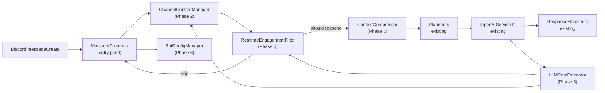

# Realtime Engagement System — Field Notes

## Purpose
We’re replacing the old “catchup” sweep with a realtime engagement loop that behaves like a considerate teammate. The bot still knows how to stay quiet, but now it can keep lightweight channel memory, track OpenAI spend, and explain why it spoke up. Think of this doc as the single-feature-branch guide for building the stack without getting lost in management overhead.

## Overview Flow


### House Style
- Everything fails open: if a phase breaks, the legacy path still runs.
- Structured JSON logs everywhere.
- Keep “graceful presence” in mind — the bot’s job is to support, not to dominate.

---

## Phase 1 — CatchupFilter (done, foundation we stand on)
**Goal:** Keep obvious low-signal chatter away from the planner.  
**Key tasks:** Maintain the heuristics in `CatchupFilter.ts`, tidy up the skip reasons, and make sure `MessageCreate.ts` still wires it in before any heavy lifting. The filter should bias toward “let the planner decide” whenever it isn’t sure.  
**Deliverable:** Stable `CatchupFilter.shouldSkipPlanner()` that shares `{ skip, reason }` and never blocks the pipeline when it throws.

---

## Phase 2 — ChannelContextManager
**Goal:** Give the bot a short-term memory per channel/thread so later phases can read metrics instead of raw Discord history.  
**Key tasks:**  
- New `ChannelContextManager` with a rolling buffer of `StoredMessage` objects and a `ChannelMetrics` snapshot (counts, token estimates, cost tallies, flags).  
- Methods: `recordMessage`, `getRecentMessages`, `recordLLMUsage`, `evictExpired`, `resetChannel`.  
- Plumb it into `MessageCreate.ts` right after we validate the thread. Bring the feature in behind `CONTEXT_MANAGER_ENABLED` with defaults in `env.ts` and `.env.example`.  
- Structured logs like:
  ```json
  {"event":"context_state","channelId":"123","rollingMessageCount":42,"flags":[]}
  ```  
**Deliverable:** `ChannelContextManager.ts` wired into `MessageCreate.ts`, feeding metrics to the rest of the pipeline while legacy counters stay available for toggling.

---

## Phase 3 — LLMCostEstimator
**Goal:** Track OpenAI usage precisely so we can enforce cognitive budgets and keep an honest ledger.  
**Key tasks:**  
- Extend `pricing.ts` with typed model rate tables and helpers for prompt vs completion costs.  
- Build an `LLMCostEstimator` that consumes responses from `OpenAIService.ts`, emits a `CostBreakdown`, and accumulates `CumulativeTotals` per channel/guild/global.  
- Have `OpenAIService` call the estimator, then pass the breakdown into `ChannelContextManager.recordLLMUsage()`.  
- Log lines you can grep later:
  ```json
  {"event":"llm_cost","requestId":"abc","channelId":"123","totalCostUsd":0.018,"budgetRemainingUsd":4.7}
  ```  
- Feature flag: `COST_ESTIMATOR_ENABLED`.  
**Deliverable:** Cost breakdowns stored in memory and logged for every OpenAI request, with budget math ready for later phases.

---

## Phase 4 — RealtimeEngagementFilter
**Goal:** Replace heuristic-only decisions with a weighted score that understands context, cost, and preferences.  
**Key tasks:**  
- Define `EngagementWeights`, `EngagementPreferences`, and `EngagementDecision`. Use defaults from config while allowing per-channel overrides.  
- Scoring inputs: direct mentions, question marks, technical keywords, recent human exchanges, cost saturation, bot noise, DM boost, manual overrides.  
- Optional LLM “refinement” when scores land in the grey zone — keep it off by default but ready.  
- Integrate in `MessageCreate.ts`: fetch metrics from Phase 2, costs from Phase 3, preferences from Phase 6, then decide to respond or skip.  
- Log decisions as compact JSON. Example:
  ```json
  {"event":"engagement_decision","channelId":"123","score":0.72,"shouldRespond":true,"reasons":["mention","question"]}
  ```  
- Feature flag: `REALTIME_FILTER_ENABLED`. CatchupFilter remains the fallback.  
**Deliverable:** `RealtimeEngagementFilter.ts` returning transparent decisions so Planner knows whether to speak.

---

## Phase 5 — ContextCompressor
**Goal:** Keep prompts lean without losing meaning by summarizing or trimming with intent.  
**Key tasks:**  
- Create `ContextCompressor` with `CompressionConfig` and `CompressionResult`. It should understand token budgets (`maxContextTokens`, `targetContextTokens`), pick a summarization model, and cache results when possible.  
- Blend heuristics: keep the freshest human messages, collapse older chatter into summaries, bail out gracefully if quality drops below `qualityThreshold`.  
- Hook into `ContextBuilder.ts` so planner always sees compressed output when enabled.  
- Log outcomes, e.g.:
  ```json
  {"event":"context_compression","channelId":"123","originalTokens":3800,"compressedTokens":2100,"ratio":0.55}
  ```  
- Feature flag: `CONTEXT_COMPRESSION_ENABLED`.  
**Deliverable:** Compression pipeline that reduces token spend and hands Planner a tight context payload.

---

## Phase 6 — BotConfigManager
**Goal:** Pull all the knobs — budgets, weights, feature flags — into one typed config surface so we stop spelunking `process.env`.  
**Key tasks:**  
- Build `BotConfigManager` that loads from `env.ts` (plus optional JSON overrides later), validates values, and hands out typed structures for the earlier phases.  
- Provide helpers: `getContextManagerConfig`, `getEngagementWeights`, `getPreferencesForChannel`, `getCompressionConfig`, `getCognitiveBudget`, `isFeatureEnabled`.  
- Update modules to request config through this manager instead of touching envs directly.  
- Emit a single sanitized log on boot:
  ```json
  {"event":"bot_config_loaded","featureFlags":{"REALTIME_FILTER_ENABLED":false}}
  ```  
- Flag: `BOT_CONFIG_MANAGER_ENABLED` so we can roll back quickly.  
**Deliverable:** `BotConfigManager.ts` with modules reading from it, `.env.example` refreshed, and the old ad-hoc env code ready to delete once we’re confident.

---

## Phase 7 — Integration & Observability
**Goal:** Thread everything together in `MessageCreate.ts`, harden the pipeline, and make sure we can see what it’s doing in production.  
**Key tasks:**  
- Refactor `MessageCreate` to inject the new managers, route messages through context → filter → compression → planner, and use fail-open guards around every hop.  
- Create a shared `logPipelineEvent()` helper so we output consistent JSON with fields like `event`, `phase`, `channelId`, `latencyMs`, `decisionPath`.  
- Wire Prometheus (or existing metrics stack) counters/gauges/histograms for: context buffer, cost totals, engagement scores, compression ratio, pipeline latency, fallback count.  
- Add chaos mode toggles to simulate failures and confirm we gracefully degrade to the legacy path.  
- Update runbooks with the new logs, metrics, and feature flags.  
- Feature flag: `PIPELINE_V2_ENABLED` to switch the whole thing on or off.  
**Deliverable:** One coherent pipeline in `MessageCreate.ts`, with logs and metrics proving fail-open and visibility work end-to-end.

---

### Quick Field Reminders
- **Feature flags:** toggle each phase (`CONTEXT_MANAGER_ENABLED`, `COST_ESTIMATOR_ENABLED`, `REALTIME_FILTER_ENABLED`, `CONTEXT_COMPRESSION_ENABLED`, `BOT_CONFIG_MANAGER_ENABLED`, `PIPELINE_V2_ENABLED`) while keeping legacy paths warm.
- **Testing habit:** write unit tests for new modules first, then lean on lightweight integration tests that stub Discord messages. Add at least one privacy regression any time log schema changes.
- **Fallback mantra:** wrap every module call in a try/catch that logs the failure, tags it with the phase, and hands control back to the old path. If you see more than a handful of fallback logs per hour, pause and investigate before proceeding.
- **Cost sanity check:** cross-check `llm_cost` logs with OpenAI usage once per sprint; a <5% delta means the estimator is healthy.
- **Human-in-the-loop signals:** keep reasons arrays human readable, because moderators will read them verbatim when deciding whether to tune weights.
- **Fail-open in practice:**
  ```ts
  try {
    return await realtimeFilter.decide(input);
  } catch (error) {
    logger.warn({ event: 'filter_fallback', channelId: input.channelId, error: String(error) });
    return { shouldRespond: !legacy.skip, score: legacy.skip ? 0 : 1, reasons: ['legacy-fallback', legacy.reason] };
  }
  ```

---

## Final Architecture Snapshot


## Final Note
Ship each phase like you would a reliable teammate: fail-open when things wobble, speak in structured logs so others can follow along, and aim for that “graceful presence” where the system helps without hogging the room. Ping if anything feels muddy — better to refine together than surprise the channel later.
