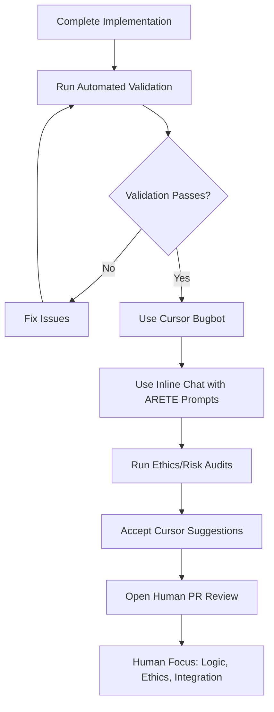

# ARETE Cursor Pre-Review Workflow

## Overview

ARETE uses Cursor IDE's automated analysis capabilities to perform structural pre-review before human code review. This workflow augments human judgment by focusing on mechanical thoroughness while preserving human expertise for logic, ethics, and integration decisions.

## Philosophy

- **Augment, Don't Replace**: Cursor handles mechanical consistency; humans handle ethical judgment
- **Traceability First**: All AI interactions must be auditable and explainable
- **Fail-Open Design**: When uncertain, don't block execution
- **Ethics-Aligned Development**: Every change maintains ARETE's ethical framework

## Workflow Architecture



## Implementation Components

### 1. Automated Validation Pipeline

**Scripts** (`package.json`):
```json
{
  "scripts": {
    "pre-review": "npm run validate-arete-tags && npm run type-check && npm run lint-check",
    "full-pre-review": "npm run pre-review && npm run ethics-check && npm run risk-check",
    "ethics-check": "npm run ethics-audit",
    "risk-check": "npm run risk-audit"
  }
}
```

**Purpose**: Ensures ARETE-specific requirements are met before Cursor analysis.

### 2. Cursor Task Integration

**Configuration** (`.cursor/tasks.json`):
```json
{
  "commands": {
    "pre-review": "npm run pre-review",
    "full-pre-review": "npm run full-pre-review",
    "ethics-check": "npm run ethics-check",
    "risk-check": "npm run risk-check"
  },
  "tasks": {
    "pre-review": {
      "command": "npm run pre-review",
      "description": "Run automated validation pipeline (ARETE tags, types, linting)"
    }
  }
}
```

**Purpose**: Provides quick access to validation commands through Cursor's interface.

### 3. Pre-Review Checklist

**File**: `.cursor/pre-review-checklist.md`

**Sections**:
- Automated validation steps
- ARETE-specific requirements
- Code quality standards
- Framework compliance
- Pre-Cursor analysis questions
- Success criteria

**Purpose**: Ensures comprehensive coverage before Cursor analysis.

### 4. ARETE-Specific Prompts

**File**: `.cursor/arete-prompts.md`

**Categories**:
- Module analysis prompts
- Code quality prompts
- Architecture & design prompts
- Testing & validation prompts
- Ethics & safety prompts
- Component-specific prompts

**Purpose**: Provides consistent, effective Cursor interactions tailored to ARETE's needs.

## Detailed Workflow Steps

### Step 1: Complete Implementation
- Finish your feature or bug fix
- Ensure basic functionality works
- Add any necessary tests

### Step 2: Run Automated Validation
```bash
npm run pre-review
```

**What it checks**:
- ARETE module tagging compliance
- TypeScript type safety
- ESLint code quality
- Basic structural integrity

### Step 3: Use Cursor's Bugbot (Review PR)
- Enable Cursor's automated PR review
- Let it analyze code quality, bugs, and security issues
- Review suggested fixes and improvements

### Step 4: Use Inline Chat with ARETE Prompts
- Use `Ctrl+K` (or `Cmd+K` on Mac) for inline chat
- Apply prompts from `.cursor/arete-prompts.md`
- Focus on complexity, comments, and framework compliance

**Example prompts**:
```
Check this function for ARETE module tagging compliance
Analyze this function for complexity issues
Review the comments in this code for quality and completeness
```

### Step 5: Run Ethics/Risk Audits
```bash
npm run ethics-check && npm run risk-check
```

**What it validates**:
- Risk level accuracy
- Ethics level appropriateness
- Compliance with ARETE framework

### Step 6: Accept Cursor Suggestions
- Review all suggested simplifications
- Accept comments and documentation improvements
- Address any flagged issues

### Step 7: Open Human PR Review
- Human reviewers focus on:
  - Logic correctness
  - Ethical implications
  - Integration concerns
  - Architectural decisions

## ARETE-Specific Requirements

### Module Documentation
Every module must include:
```typescript
/**
 * @arete-module: <ModuleName>
 * @arete-risk: <high|high|moderate|low>
 * @arete-ethics: <high|high|moderate|low>
 * @arete-scope: <core|utility|interface|test>
 * 
 * @description: <1-3 lines summarizing what this module does.>
 * 
 * @impact
 * Risk: <What could break or be compromised if mishandled.>
 * Ethics: <What human or governance impacts errors could cause.>
 */
```

### Code Quality Standards
- **Structured Logging**: Use `logger.ts` for all log statements
- **Cost Tracking**: All LLM interactions use `ChannelContextManager.recordLLMUsage()`
- **Fail-Open Design**: Uncertain operations don't block execution
- **Error Handling**: Risky operations wrapped in `try/catch`
- **TypeScript**: Explicit types everywhere, no `any` usage

### Comment Standards
- Explain "why" and "what", not just "how"
- Document business logic and important decisions
- Explain edge cases and potential gotchas
- Provide context for external dependencies
- Use parenthetical explanations for technical terms

## Success Metrics

### Quantitative Metrics
- **Reduction in human review time**: Focus on logic vs. mechanics
- **Fewer ARETE tagging violations**: Automated validation catches issues
- **Improved comment quality**: Measured by contributor feedback
- **Faster onboarding**: New contributors follow structured checklist

### Qualitative Metrics
- **Human reviewer satisfaction**: Focus on high-value decisions
- **Code maintainability**: Better documentation and structure
- **Ethical compliance**: Consistent adherence to ARETE framework
- **Knowledge transfer**: Comments help new contributors understand

## Troubleshooting

### Issue: Missing ARETE Tags
**Solution**: Run `npm run validate-arete-tags` first
**Prevention**: Use pre-review checklist

### Issue: Inadequate Comments
**Solution**: Use comment quality prompts from `.cursor/arete-prompts.md`
**Prevention**: Follow commenting standards in `cursor.rules`

### Issue: Inconsistent Logging
**Solution**: Use structured logger prompts
**Prevention**: Automated validation catches violations

### Issue: Missing Cost Tracking
**Solution**: Use cost tracking prompts
**Prevention**: Framework compliance checks

### Issue: Overly Complex Functions
**Solution**: Use complexity analysis prompts
**Prevention**: Break down functions during development

## Integration with Existing Tools

### CI/CD Pipeline
- `npm run validate-arete-tags` runs in CI
- Prevents merging code with missing tags
- Enforces ARETE standards automatically

### Development Environment
- Cursor tasks provide quick access to validation
- Inline chat integrates with existing workflow
- Prompts ensure consistent analysis

### Human Review Process
- Human reviewers focus on ethics and integration
- Cursor handles mechanical consistency
- Clear separation of concerns

## Best Practices

### For Contributors
1. **Always run validation first**: `npm run pre-review`
2. **Use structured prompts**: Follow `.cursor/arete-prompts.md`
3. **Follow the checklist**: Use `.cursor/pre-review-checklist.md`
4. **Ask specific questions**: Use inline chat effectively
5. **Document decisions**: Explain "why" not just "how"

### For Maintainers
1. **Trust the automation**: Let Cursor handle mechanics
2. **Focus on ethics**: Human judgment for ethical implications
3. **Review integration**: Ensure changes work with existing systems
4. **Maintain standards**: Update prompts and checklist as needed

### For New Contributors
1. **Start with the checklist**: Follow `.cursor/pre-review-checklist.md`
2. **Use the prompts**: Reference `.cursor/arete-prompts.md`
3. **Ask questions**: Use inline chat to understand ARETE patterns
4. **Learn the framework**: Understand ARETE's ethics-first approach

## Future Enhancements

### Planned Improvements
- **Automated prompt suggestions**: Cursor suggests relevant prompts
- **Integration with GitHub**: Automated PR comments from Cursor
- **Metrics dashboard**: Track workflow effectiveness
- **Custom validation rules**: Project-specific checks

### Potential Extensions
- **Multi-language support**: Extend to other programming languages
- **Team collaboration**: Shared prompt libraries
- **Learning system**: Cursor learns from human review patterns
- **Ethics scoring**: Automated ethics impact assessment

## Conclusion

The ARETE Cursor Pre-Review Workflow represents a comprehensive approach to augmenting human code review with AI assistance. By focusing on mechanical consistency while preserving human judgment for ethical and architectural decisions, this workflow maintains ARETE's commitment to traceable, ethics-aligned development.

The key to success is the integration of automated validation, structured prompts, and clear workflows that ensure both efficiency and quality. Human reviewers can focus on what matters most—ethical implications, logical correctness, and system integration—while Cursor handles the mechanical aspects of code quality and consistency.

This approach scales well with team growth, maintains high standards, and ensures that ARETE's ethical framework is consistently applied across all development work.

---

**Template Note**: This document can be adapted for other projects by:
1. Replacing ARETE-specific requirements with project-specific standards
2. Updating validation scripts to match project needs
3. Customizing prompts for project architecture
4. Adapting the checklist for project-specific requirements
5. Modifying success metrics for project goals

